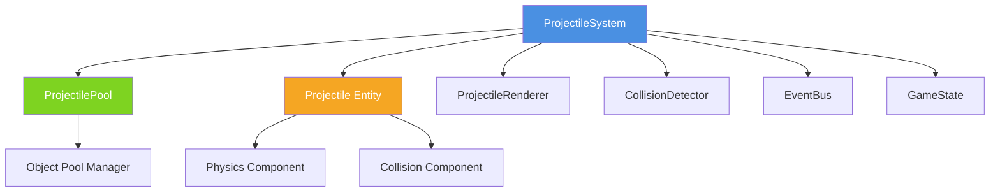
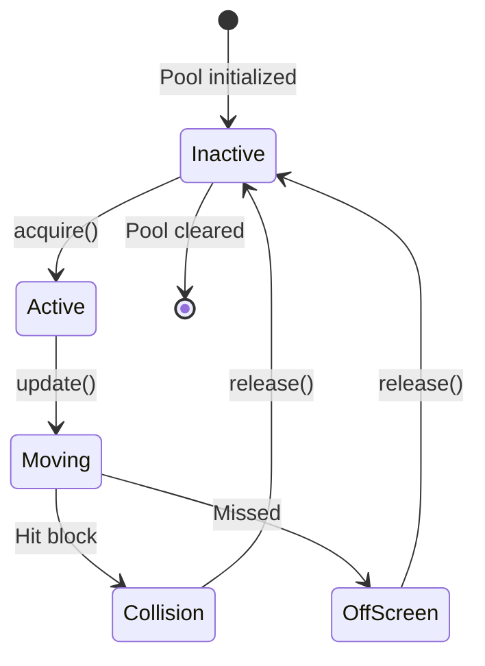

# ProjectileSystem Architecture Design Document

**Document Version**: v1.0  
**Created**: 2025-01-08  
**Author**: Winston (System Architect)  
**Status**: Draft - Pending Approval  
**Related Story**: [Story 4.3b - Advanced PowerUps Phase 2](../stories/4.3b.advanced-powerups-phase2.md)

---

## Executive Summary

This document defines the architecture for the **ProjectileSystem**, a new subsystem required for the Laser Gun power-up in Story 4.3b. The ProjectileSystem manages laser projectiles fired from the paddle, including lifecycle management, collision detection, rendering, and performance optimization through object pooling.

**Key Design Goals**:
- ✅ Integration with existing game loop and systems
- ✅ High performance through object pooling (target: 60 FPS)
- ✅ Clean separation of concerns following ECS architecture
- ✅ Extensibility for future projectile types
- ✅ Memory efficiency (<250MB total game memory)

**Architecture Style**: Entity-Component-System (ECS) following existing game architecture patterns

---

## Table of Contents

1. [System Context](#1-system-context)
2. [Core Architecture](#2-core-architecture)
3. [Component Specifications](#3-component-specifications)
4. [Integration Points](#4-integration-points)
5. [Object Pooling Strategy](#5-object-pooling-strategy)
6. [Rendering Pipeline](#6-rendering-pipeline)
7. [Performance Considerations](#7-performance-considerations)
8. [Testing Strategy](#8-testing-strategy)
9. [Implementation Plan](#9-implementation-plan)
10. [Appendix](#10-appendix)

---

## 1. System Context

### 1.1 Problem Statement

Story 4.3b introduces the **Laser Gun** power-up, which allows players to shoot laser projectiles from the paddle to destroy blocks. This requires a new system to:

- Spawn projectiles from paddle position
- Update projectile positions each frame
- Detect collisions with blocks
- Remove off-screen or collided projectiles
- Maintain performance with multiple projectiles active

### 1.2 Existing Architecture Integration

The ProjectileSystem integrates with the following existing systems:

```
┌─────────────────────────────────────────────────────────┐
│                      GameLoop                            │
│  (60 FPS fixed timestep, deltaTime normalization)       │
└─────────────────────────────────────────────────────────┘
                         │
                         ↓
┌─────────────────────────────────────────────────────────┐
│                  System Updates                          │
├─────────────────────────────────────────────────────────┤
│  PhysicsSystem → CollisionDetector → ProjectileSystem   │
│       ↓                ↓                    ↓            │
│  ParticleSystem ←  BlockManager  ←  PowerUpSystem       │
└─────────────────────────────────────────────────────────┘
                         │
                         ↓
┌─────────────────────────────────────────────────────────┐
│                  Rendering Pipeline                      │
│  Background → Blocks → Projectiles → Balls → Particles  │
└─────────────────────────────────────────────────────────┘
```

**Key Integration Points**:
1. **GameLoop**: ProjectileSystem.update() called each frame
2. **CollisionDetector**: Reuse existing collision detection logic
3. **BlockManager**: Notify of block destruction
4. **Renderer**: Register projectiles for rendering
5. **EventBus**: Emit projectile lifecycle events

### 1.3 Design Constraints

| Constraint | Value | Rationale |
|------------|-------|-----------|
| Max concurrent projectiles | 20 | Laser fires at 2/sec for 20 sec = max 40, pool size 20 with fast recycling |
| Projectile speed | 500 px/sec | Fast enough to feel responsive, slow enough for visibility |
| Projectile size | 4x12 px | Visible but not obtrusive |
| Fire rate | 2 shots/sec | Balanced gameplay, not overwhelming |
| Memory budget | <10 MB | Part of 250MB total game budget |
| Performance impact | <2ms/frame | Maintain 60 FPS (16.67ms budget) |

---

## 2. Core Architecture

### 2.1 System Overview



### 2.2 Class Diagram

```typescript
/**
 * Core ProjectileSystem Architecture
 */

// ============================================================================
// 1. Projectile Entity
// ============================================================================

interface Vector2D {
  x: number;
  y: number;
}

interface ProjectileConfig {
  speed: number;        // pixels per second
  width: number;        // 4px
  height: number;       // 12px
  damage: number;       // instant destroy (1)
  color: string;        // '#FF0000' (red laser)
}

class Projectile {
  id: string;
  position: Vector2D;
  velocity: Vector2D;
  config: ProjectileConfig;
  active: boolean;
  
  constructor(config: ProjectileConfig);
  update(deltaTime: number): void;
  reset(): void;
  getBounds(): Rectangle;
}

// ============================================================================
// 2. ProjectileSystem
// ============================================================================

interface ProjectileSystemConfig {
  maxProjectiles: number;     // 20
  poolSize: number;           // 20
  fireRate: number;           // 500ms (2/sec)
  enableCollision: boolean;   // true
  enableAutoCleanup: boolean; // true
}

class ProjectileSystem {
  private projectiles: Projectile[];
  private pool: ProjectilePool;
  private collisionDetector: CollisionDetector;
  private eventBus: EventBus;
  private config: ProjectileSystemConfig;
  private lastFireTime: number;
  
  constructor(
    collisionDetector: CollisionDetector,
    eventBus: EventBus,
    config?: Partial<ProjectileSystemConfig>
  );
  
  // Lifecycle
  update(deltaTime: number, gameState: GameState): void;
  shutdown(): void;
  
  // Projectile management
  fireProjectile(position: Vector2D, direction: Vector2D): Projectile | null;
  removeProjectile(projectileId: string): void;
  clearAllProjectiles(): void;
  
  // Queries
  getActiveProjectiles(): Projectile[];
  getProjectileCount(): number;
  canFire(): boolean;
  
  // Performance
  getPerformanceStats(): ProjectileSystemStats;
}

// ============================================================================
// 3. ProjectilePool (Object Pooling)
// ============================================================================

class ProjectilePool {
  private pool: Projectile[];
  private activeSet: Set<string>;
  private config: ProjectileConfig;
  private poolSize: number;
  
  constructor(poolSize: number, config: ProjectileConfig);
  
  acquire(position: Vector2D, velocity: Vector2D): Projectile | null;
  release(projectile: Projectile): void;
  clear(): void;
  
  getAvailableCount(): number;
  getActiveCount(): number;
}

// ============================================================================
// 4. Integration Interfaces
// ============================================================================

interface GameState {
  paddle: Paddle;
  blocks: Block[];
  canvasWidth: number;
  canvasHeight: number;
}

interface ProjectileSystemStats {
  activeProjectiles: number;
  poolUtilization: number;
  totalFired: number;
  totalHits: number;
  totalMissed: number;
  hitRate: number;
}
```

### 2.3 Component Responsibilities

| Component | Responsibility | Dependencies |
|-----------|---------------|--------------|
| **ProjectileSystem** | Core system coordinator, lifecycle management | CollisionDetector, EventBus, ProjectilePool |
| **Projectile** | Individual projectile entity, position/velocity updates | None (pure entity) |
| **ProjectilePool** | Object pooling for memory efficiency | None |
| **ProjectileRenderer** | Render projectiles to canvas | Canvas context |

---

## 3. Component Specifications

### 3.1 Projectile Entity

**File**: `src/game/entities/Projectile.ts`

```typescript
/**
 * Projectile Entity
 * Represents a single laser projectile fired from paddle
 */
export interface ProjectileConfig {
  speed: number;        // 500 pixels/second
  width: number;        // 4 pixels
  height: number;       // 12 pixels
  damage: number;       // 1 (instant destroy)
  color: string;        // '#FF0000'
}

export class Projectile {
  public readonly id: string;
  public position: Vector2D;
  public velocity: Vector2D;
  public readonly config: ProjectileConfig;
  public active: boolean;

  constructor(config: ProjectileConfig) {
    this.id = `projectile_${Date.now()}_${Math.random()}`;
    this.position = { x: 0, y: 0 };
    this.velocity = { x: 0, y: 0 };
    this.config = config;
    this.active = false;
  }

  /**
   * Update projectile position based on velocity
   */
  public update(deltaTime: number): void {
    if (!this.active) return;
    
    this.position.x += this.velocity.x * deltaTime;
    this.position.y += this.velocity.y * deltaTime;
  }

  /**
   * Reset projectile to inactive state (for pooling)
   */
  public reset(): void {
    this.active = false;
    this.position = { x: 0, y: 0 };
    this.velocity = { x: 0, y: 0 };
  }

  /**
   * Get bounding rectangle for collision detection
   */
  public getBounds(): Rectangle {
    return {
      x: this.position.x - this.config.width / 2,
      y: this.position.y - this.config.height / 2,
      width: this.config.width,
      height: this.config.height
    };
  }
}
```

**Design Decisions**:
- ✅ Simple data entity following existing Entity pattern
- ✅ Immutable ID for tracking
- ✅ Reset method for efficient pooling
- ✅ getBounds() for collision detection integration

### 3.2 ProjectileSystem

**File**: `src/game/systems/ProjectileSystem.ts`

```typescript
/**
 * ProjectileSystem
 * Manages lifecycle of all projectiles in the game
 */
export interface ProjectileSystemConfig {
  maxProjectiles: number;      // 20
  poolSize: number;            // 20
  fireRate: number;            // 500 (ms between shots)
  enableCollision: boolean;    // true
  enableAutoCleanup: boolean;  // true
}

export interface ProjectileSystemStats {
  activeProjectiles: number;
  poolUtilization: number;
  totalFired: number;
  totalHits: number;
  totalMissed: number;
  hitRate: number;
}

export class ProjectileSystem {
  private projectiles: Projectile[] = [];
  private pool: ProjectilePool;
  private collisionDetector: CollisionDetector;
  private eventBus: EventBus;
  private config: ProjectileSystemConfig;
  private lastFireTime: number = 0;
  
  // Performance tracking
  private stats: ProjectileSystemStats;

  constructor(
    collisionDetector: CollisionDetector,
    eventBus: EventBus,
    config?: Partial<ProjectileSystemConfig>
  ) {
    this.collisionDetector = collisionDetector;
    this.eventBus = eventBus;
    this.config = {
      maxProjectiles: 20,
      poolSize: 20,
      fireRate: 500,
      enableCollision: true,
      enableAutoCleanup: true,
      ...config
    };
    
    // Initialize pool
    const projectileConfig: ProjectileConfig = {
      speed: 500,
      width: 4,
      height: 12,
      damage: 1,
      color: '#FF0000'
    };
    this.pool = new ProjectilePool(this.config.poolSize, projectileConfig);
    
    // Initialize stats
    this.stats = {
      activeProjectiles: 0,
      poolUtilization: 0,
      totalFired: 0,
      totalHits: 0,
      totalMissed: 0,
      hitRate: 0
    };
  }

  /**
   * Main update loop - called each frame
   */
  public update(deltaTime: number, gameState: GameState): void {
    const currentTime = Date.now();
    
    // Update all active projectiles
    for (let i = this.projectiles.length - 1; i >= 0; i--) {
      const projectile = this.projectiles[i];
      
      if (!projectile.active) {
        this.projectiles.splice(i, 1);
        continue;
      }
      
      // Update position
      projectile.update(deltaTime);
      
      // Check collision with blocks
      if (this.config.enableCollision) {
        const hit = this.checkCollisions(projectile, gameState.blocks);
        if (hit) {
          this.handleHit(projectile, hit);
          this.projectiles.splice(i, 1);
          continue;
        }
      }
      
      // Check if projectile is off-screen
      if (this.isOffScreen(projectile, gameState)) {
        this.handleMiss(projectile);
        this.projectiles.splice(i, 1);
      }
    }
    
    // Update stats
    this.updateStats();
  }

  /**
   * Fire a new projectile from paddle position
   */
  public fireProjectile(position: Vector2D, direction: Vector2D): Projectile | null {
    const currentTime = Date.now();
    
    // Check fire rate limit
    if (currentTime - this.lastFireTime < this.config.fireRate) {
      return null;
    }
    
    // Check max projectiles limit
    if (this.projectiles.length >= this.config.maxProjectiles) {
      return null;
    }
    
    // Acquire from pool
    const velocity: Vector2D = {
      x: direction.x * 500, // Assuming config.speed = 500
      y: direction.y * 500
    };
    
    const projectile = this.pool.acquire(position, velocity);
    if (!projectile) {
      return null; // Pool exhausted
    }
    
    // Add to active projectiles
    this.projectiles.push(projectile);
    this.lastFireTime = currentTime;
    this.stats.totalFired++;
    
    // Emit event
    this.eventBus.emit('projectile:fired', {
      projectileId: projectile.id,
      position: { ...position },
      direction: { ...direction }
    });
    
    return projectile;
  }

  /**
   * Check if system can fire (respecting fire rate)
   */
  public canFire(): boolean {
    const currentTime = Date.now();
    return (
      currentTime - this.lastFireTime >= this.config.fireRate &&
      this.projectiles.length < this.config.maxProjectiles &&
      this.pool.getAvailableCount() > 0
    );
  }

  /**
   * Get all active projectiles
   */
  public getActiveProjectiles(): Projectile[] {
    return this.projectiles.filter(p => p.active);
  }

  /**
   * Get performance statistics
   */
  public getPerformanceStats(): ProjectileSystemStats {
    return { ...this.stats };
  }

  /**
   * Clear all projectiles (for level end, power-up expiration)
   */
  public clearAllProjectiles(): void {
    for (const projectile of this.projectiles) {
      this.pool.release(projectile);
    }
    this.projectiles = [];
  }

  /**
   * Shutdown system and cleanup resources
   */
  public shutdown(): void {
    this.clearAllProjectiles();
    this.pool.clear();
  }

  // ========================================================================
  // Private Helper Methods
  // ========================================================================

  private checkCollisions(projectile: Projectile, blocks: Block[]): Block | null {
    const projectileBounds = projectile.getBounds();
    
    for (const block of blocks) {
      if (!block.active) continue;
      
      const blockBounds = block.getBounds();
      const collision = CollisionDetector.checkRectangleRectangle(
        projectileBounds,
        blockBounds
      );
      
      if (collision.collided) {
        return block;
      }
    }
    
    return null;
  }

  private handleHit(projectile: Projectile, block: Block): void {
    // Emit collision event
    this.eventBus.emit('projectile:hit', {
      projectileId: projectile.id,
      blockId: block.id,
      position: { ...projectile.position }
    });
    
    // Update stats
    this.stats.totalHits++;
    
    // Return projectile to pool
    this.pool.release(projectile);
  }

  private handleMiss(projectile: Projectile): void {
    // Emit miss event
    this.eventBus.emit('projectile:missed', {
      projectileId: projectile.id
    });
    
    // Update stats
    this.stats.totalMissed++;
    
    // Return projectile to pool
    this.pool.release(projectile);
  }

  private isOffScreen(projectile: Projectile, gameState: GameState): boolean {
    return (
      projectile.position.y < -projectile.config.height ||
      projectile.position.y > gameState.canvasHeight + projectile.config.height ||
      projectile.position.x < -projectile.config.width ||
      projectile.position.x > gameState.canvasWidth + projectile.config.width
    );
  }

  private updateStats(): void {
    this.stats.activeProjectiles = this.projectiles.length;
    this.stats.poolUtilization = this.pool.getActiveCount() / this.config.poolSize;
    this.stats.hitRate = this.stats.totalFired > 0
      ? this.stats.totalHits / this.stats.totalFired
      : 0;
  }
}
```

**Design Decisions**:
- ✅ Fire rate limiting prevents spam
- ✅ Max projectiles limit prevents performance issues
- ✅ Off-screen cleanup prevents memory leaks
- ✅ Event-driven architecture for loose coupling
- ✅ Performance stats for monitoring

### 3.3 ProjectilePool (Object Pooling)

**File**: `src/game/utils/ProjectilePool.ts`

```typescript
/**
 * ProjectilePool
 * Object pool for efficient projectile memory management
 */
export class ProjectilePool {
  private pool: Projectile[];
  private activeSet: Set<string>;
  private readonly poolSize: number;
  private readonly config: ProjectileConfig;

  constructor(poolSize: number, config: ProjectileConfig) {
    this.poolSize = poolSize;
    this.config = config;
    this.pool = [];
    this.activeSet = new Set();
    
    // Pre-allocate projectiles
    for (let i = 0; i < poolSize; i++) {
      this.pool.push(new Projectile(config));
    }
  }

  /**
   * Acquire projectile from pool
   */
  public acquire(position: Vector2D, velocity: Vector2D): Projectile | null {
    // Find inactive projectile
    const projectile = this.pool.find(p => !p.active);
    
    if (!projectile) {
      console.warn('ProjectilePool exhausted');
      return null;
    }
    
    // Activate and configure
    projectile.active = true;
    projectile.position = { ...position };
    projectile.velocity = { ...velocity };
    this.activeSet.add(projectile.id);
    
    return projectile;
  }

  /**
   * Release projectile back to pool
   */
  public release(projectile: Projectile): void {
    projectile.reset();
    this.activeSet.delete(projectile.id);
  }

  /**
   * Clear all projectiles and reset pool
   */
  public clear(): void {
    for (const projectile of this.pool) {
      projectile.reset();
    }
    this.activeSet.clear();
  }

  /**
   * Get number of available projectiles
   */
  public getAvailableCount(): number {
    return this.poolSize - this.activeSet.size;
  }

  /**
   * Get number of active projectiles
   */
  public getActiveCount(): number {
    return this.activeSet.size;
  }
}
```

**Design Decisions**:
- ✅ Pre-allocate all projectiles at initialization
- ✅ O(n) acquire but n=20, acceptable
- ✅ O(1) release using Set
- ✅ No dynamic allocation during gameplay

---

## 4. Integration Points

### 4.1 GameLoop Integration

**File**: `src/game/core/GameLoop.ts`

```typescript
// Add ProjectileSystem to game loop update cycle

class GameLoop {
  private projectileSystem: ProjectileSystem;
  
  public update(deltaTime: number): void {
    // Existing updates...
    this.physicsSystem.update(deltaTime);
    this.collisionDetector.update(deltaTime);
    
    // NEW: Add ProjectileSystem update
    this.projectileSystem.update(deltaTime, this.getGameState());
    
    // Existing updates...
    this.particleSystem.update(deltaTime);
  }
}
```

**Update Order**: PhysicsSystem → CollisionDetector → **ProjectileSystem** → ParticleSystem

### 4.2 Collision Detection Integration

**File**: `src/game/physics/CollisionDetector.ts`

```typescript
// Add rectangle-rectangle collision for projectiles

class CollisionDetector {
  /**
   * Check collision between two rectangles (for projectile-block)
   */
  public static checkRectangleRectangle(
    rect1: Rectangle,
    rect2: Rectangle
  ): CollisionInfo {
    const collided = !(
      rect1.x + rect1.width < rect2.x ||
      rect1.x > rect2.x + rect2.width ||
      rect1.y + rect1.height < rect2.y ||
      rect1.y > rect2.y + rect2.height
    );
    
    if (!collided) {
      return { collided: false };
    }
    
    // Calculate overlap for response
    const overlapX = Math.min(
      rect1.x + rect1.width - rect2.x,
      rect2.x + rect2.width - rect1.x
    );
    const overlapY = Math.min(
      rect1.y + rect1.height - rect2.y,
      rect2.y + rect2.height - rect1.y
    );
    
    return {
      collided: true,
      penetration: Math.min(overlapX, overlapY),
      normal: overlapX < overlapY 
        ? { x: Math.sign(rect1.x - rect2.x), y: 0 }
        : { x: 0, y: Math.sign(rect1.y - rect2.y) }
    };
  }
}
```

### 4.3 Rendering Integration

**File**: `src/game/rendering/Renderer.ts`

```typescript
// Add ProjectileSystem to rendering pipeline

class Renderer {
  private projectileSystem: ProjectileSystem;
  
  public render(ctx: CanvasRenderingContext2D): void {
    // Existing rendering...
    this.renderBlocks(ctx);
    
    // NEW: Render projectiles (before balls, after blocks)
    this.renderProjectiles(ctx);
    
    // Existing rendering...
    this.renderBalls(ctx);
    this.renderParticles(ctx);
  }
  
  private renderProjectiles(ctx: CanvasRenderingContext2D): void {
    const projectiles = this.projectileSystem.getActiveProjectiles();
    
    ctx.fillStyle = '#FF0000'; // Red laser
    ctx.shadowColor = '#FF0000';
    ctx.shadowBlur = 10;
    
    for (const projectile of projectiles) {
      const bounds = projectile.getBounds();
      ctx.fillRect(bounds.x, bounds.y, bounds.width, bounds.height);
    }
    
    ctx.shadowBlur = 0; // Reset shadow
  }
}
```

**Rendering Order**: Background → Blocks → **Projectiles** → Balls → Particles → HUD

### 4.4 Power-Up Plugin Integration

**File**: `src/game/plugins/powerups/LaserGunPowerUp.ts`

```typescript
/**
 * LaserGunPowerUp Plugin
 * Enables laser shooting from paddle
 */
export class LaserGunPowerUp extends BasePowerUpPlugin {
  private fireInterval?: NodeJS.Timeout;
  private projectileSystem: ProjectileSystem;
  
  constructor(projectileSystem: ProjectileSystem) {
    super();
    this.projectileSystem = projectileSystem;
  }
  
  public applyEffect(context: PowerUpPluginContext): EffectResult {
    // Start firing lasers at 2 shots/second
    this.fireInterval = setInterval(() => {
      if (!context.gameState.paddle) return;
      
      const paddle = context.gameState.paddle;
      
      // Fire from both edges of paddle
      const leftPosition = {
        x: paddle.position.x - paddle.width / 2,
        y: paddle.position.y
      };
      const rightPosition = {
        x: paddle.position.x + paddle.width / 2,
        y: paddle.position.y
      };
      
      const direction = { x: 0, y: -1 }; // Shoot upward
      
      this.projectileSystem.fireProjectile(leftPosition, direction);
      this.projectileSystem.fireProjectile(rightPosition, direction);
      
      // Play sound
      // audioSystem.playSound('laser');
      
    }, 500); // 2 shots/second
    
    return { success: true, modified: true };
  }
  
  public removeEffect(context: PowerUpPluginContext): EffectResult {
    if (this.fireInterval) {
      clearInterval(this.fireInterval);
      this.fireInterval = undefined;
    }
    
    // Clear all projectiles when power-up ends
    this.projectileSystem.clearAllProjectiles();
    
    return { success: true, modified: true };
  }
}
```

### 4.5 EventBus Events

**File**: `src/game/core/EventBus.ts`

```typescript
// Add new event types for projectiles

export enum GameEventType {
  // Existing events...
  BALL_COLLISION = 'ball:collision',
  BLOCK_DESTROYED = 'block:destroyed',
  
  // NEW: Projectile events
  PROJECTILE_FIRED = 'projectile:fired',
  PROJECTILE_HIT = 'projectile:hit',
  PROJECTILE_MISSED = 'projectile:missed',
}

export interface GameEventPayloads {
  // Existing payloads...
  
  // NEW: Projectile payloads
  [GameEventType.PROJECTILE_FIRED]: {
    projectileId: string;
    position: Vector2D;
    direction: Vector2D;
  };
  [GameEventType.PROJECTILE_HIT]: {
    projectileId: string;
    blockId: string;
    position: Vector2D;
  };
  [GameEventType.PROJECTILE_MISSED]: {
    projectileId: string;
  };
}
```

---

## 5. Object Pooling Strategy

### 5.1 Why Object Pooling?

**Problem**: Creating and destroying projectiles every frame causes:
- Frequent garbage collection pauses
- Memory fragmentation
- Performance spikes
- FPS drops during intense gameplay

**Solution**: Pre-allocate a fixed pool of projectiles and reuse them.

### 5.2 Pool Configuration

| Parameter | Value | Rationale |
|-----------|-------|-----------|
| Pool Size | 20 | Laser fires 2/sec for 20sec = 40 total, but projectiles clear quickly |
| Max Active | 20 | Visual clarity limit, performance budget |
| Pre-allocation | 100% | All projectiles created at initialization |
| Growth Strategy | None | Fixed pool, no dynamic allocation |

### 5.3 Pooling Lifecycle



### 5.4 Memory Estimation

```
Single Projectile Memory:
- id (string): ~50 bytes
- position (Vector2D): 16 bytes
- velocity (Vector2D): 16 bytes
- config (ProjectileConfig): 32 bytes
- active (boolean): 1 byte
- Total: ~115 bytes

Pool Memory (20 projectiles):
- 20 × 115 bytes = 2.3 KB
- Pool overhead: ~1 KB
- Total: ~3.5 KB

✅ Well within 10 MB subsystem budget
```

---

## 6. Rendering Pipeline

### 6.1 Rendering Strategy

**Visual Design**:
- Red laser beams (#FF0000)
- 4px wide × 12px tall rectangles
- Glowing effect using shadowBlur
- High contrast against game background

**Rendering Order** (Z-Index):
1. Background (lowest)
2. Blocks
3. **Projectiles** ← NEW
4. Balls
5. Particles
6. HUD (highest)

### 6.2 Rendering Performance

**Optimization Techniques**:
1. **Batch Rendering**: Draw all projectiles in single pass
2. **State Caching**: Set fill style once per batch
3. **Culling**: Skip projectiles outside viewport (handled by off-screen cleanup)
4. **Shadow Optimization**: Disable shadow for non-projectile rendering

**Performance Budget**:
- Target: <0.5ms per frame for 20 projectiles
- Benchmark: Measure actual render time during testing

### 6.3 Visual Effects

```typescript
// Laser glow effect
ctx.shadowColor = '#FF0000';
ctx.shadowBlur = 10;
ctx.fillStyle = '#FF0000';

// Optional: Add trail effect using alpha gradient
ctx.globalAlpha = 0.8;
```

---

## 7. Performance Considerations

### 7.1 Performance Targets

| Metric | Target | Critical Path |
|--------|--------|---------------|
| Update time | <1ms/frame | Yes |
| Render time | <0.5ms/frame | Yes |
| Memory usage | <5 MB | No |
| FPS impact | <1% | Yes |

### 7.2 Performance Optimizations

**1. Update Loop Optimization**:
- Iterate backwards for safe removal during iteration
- Early exit for inactive projectiles
- Collision detection only for active blocks

**2. Collision Detection Optimization**:
- Rectangle-rectangle is faster than circle-rectangle
- Spatial partitioning not needed (low projectile count)
- Skip destroyed blocks in collision check

**3. Memory Optimization**:
- Fixed pool size prevents dynamic allocation
- Reset instead of destroy/create
- Reuse event objects where possible

**4. Rendering Optimization**:
- Batch all projectiles in single draw call
- Cache rendering state
- Simple rectangle rendering (no complex shapes)

### 7.3 Performance Monitoring

```typescript
// Add to ProjectileSystem
interface PerformanceMetrics {
  updateTime: number;      // ms
  renderTime: number;      // ms
  collisionChecks: number; // per frame
  activeProjectiles: number;
}

public getPerformanceMetrics(): PerformanceMetrics {
  return {
    updateTime: this.lastUpdateTime,
    renderTime: this.lastRenderTime,
    collisionChecks: this.collisionCheckCount,
    activeProjectiles: this.projectiles.length
  };
}
```

**Monitoring Strategy**:
- Log metrics in dev mode
- Alert if update time > 2ms
- Track FPS impact during testing

---

## 8. Testing Strategy

### 8.1 Unit Tests

**File**: `src/game/systems/__tests__/ProjectileSystem.test.ts`

```typescript
describe('ProjectileSystem', () => {
  describe('Projectile Lifecycle', () => {
    it('should fire projectile from paddle position');
    it('should respect fire rate limit');
    it('should not exceed max projectiles');
    it('should clean up off-screen projectiles');
  });
  
  describe('Collision Detection', () => {
    it('should detect projectile-block collision');
    it('should destroy block on hit');
    it('should release projectile after hit');
    it('should emit collision event');
  });
  
  describe('Object Pooling', () => {
    it('should reuse projectiles from pool');
    it('should return null when pool exhausted');
    it('should track pool utilization');
  });
  
  describe('Performance', () => {
    it('should handle 20 concurrent projectiles');
    it('should complete update in <2ms');
    it('should not cause memory leaks');
  });
});
```

### 8.2 Integration Tests

**File**: `src/game/systems/__tests__/ProjectileSystem.integration.test.ts`

```typescript
describe('ProjectileSystem Integration', () => {
  it('should integrate with GameLoop');
  it('should integrate with CollisionDetector');
  it('should integrate with EventBus');
  it('should work with LaserGunPowerUp');
  it('should maintain 60 FPS with 20 projectiles + multi-ball');
});
```

### 8.3 Performance Tests

**File**: `src/game/systems/__tests__/ProjectileSystem.performance.test.ts`

```typescript
describe('ProjectileSystem Performance', () => {
  it('should update 20 projectiles in <1ms', () => {
    const startTime = performance.now();
    projectileSystem.update(16, gameState);
    const elapsed = performance.now() - startTime;
    expect(elapsed).toBeLessThan(1);
  });
  
  it('should not cause memory leaks over 1000 frames', () => {
    const initialMemory = performance.memory.usedJSHeapSize;
    for (let i = 0; i < 1000; i++) {
      projectileSystem.update(16, gameState);
    }
    const finalMemory = performance.memory.usedJSHeapSize;
    const leak = finalMemory - initialMemory;
    expect(leak).toBeLessThan(1_000_000); // <1MB growth
  });
});
```

### 8.4 Test Coverage Goals

| Component | Target Coverage | Priority |
|-----------|----------------|----------|
| ProjectileSystem | 95% | P0 |
| Projectile | 90% | P0 |
| ProjectilePool | 95% | P0 |
| LaserGunPowerUp | 85% | P1 |

---

## 9. Implementation Plan

### 9.1 Implementation Phases

**Phase 1: Core Entity** (1-2 hours)
- [ ] Create `Projectile.ts` entity class
- [ ] Write unit tests for Projectile
- [ ] Verify getBounds() for collision

**Phase 2: Object Pooling** (1-2 hours)
- [ ] Create `ProjectilePool.ts`
- [ ] Write unit tests for pooling
- [ ] Benchmark pool performance

**Phase 3: System Implementation** (2-3 hours)
- [ ] Create `ProjectileSystem.ts`
- [ ] Implement update loop
- [ ] Implement collision detection
- [ ] Write unit tests

**Phase 4: Integration** (2-3 hours)
- [ ] Integrate with GameLoop
- [ ] Integrate with CollisionDetector
- [ ] Add EventBus events
- [ ] Integrate with Renderer

**Phase 5: Power-Up Plugin** (1-2 hours)
- [ ] Create `LaserGunPowerUp.ts`
- [ ] Connect to ProjectileSystem
- [ ] Test firing mechanism

**Phase 6: Testing & Optimization** (2-3 hours)
- [ ] Run integration tests
- [ ] Performance profiling
- [ ] Memory leak detection
- [ ] Optimize bottlenecks

**Total Estimated Time**: 10-15 hours

### 9.2 Implementation Order

```
1. Projectile Entity
   ↓
2. ProjectilePool
   ↓
3. ProjectileSystem (core logic)
   ↓
4. CollisionDetector Integration
   ↓
5. GameLoop Integration
   ↓
6. Renderer Integration
   ↓
7. LaserGunPowerUp Plugin
   ↓
8. EventBus Events
   ↓
9. Testing & Validation
```

### 9.3 Validation Checklist

Before marking Phase complete:
- [ ] All unit tests pass (>90% coverage)
- [ ] Integration tests pass
- [ ] Performance tests pass (<1ms update, <0.5ms render)
- [ ] Memory leak test pass (<1MB growth over 1000 frames)
- [ ] Visual validation (laser appearance correct)
- [ ] No regressions in existing power-ups
- [ ] FPS maintains 60 with 20 projectiles + 3 balls

---

## 10. Appendix

### 10.1 API Reference

**ProjectileSystem Public Methods**:

```typescript
class ProjectileSystem {
  // Core lifecycle
  update(deltaTime: number, gameState: GameState): void;
  shutdown(): void;
  
  // Projectile management
  fireProjectile(position: Vector2D, direction: Vector2D): Projectile | null;
  removeProjectile(projectileId: string): void;
  clearAllProjectiles(): void;
  
  // Queries
  getActiveProjectiles(): Projectile[];
  getProjectileCount(): number;
  canFire(): boolean;
  
  // Performance
  getPerformanceStats(): ProjectileSystemStats;
  getPerformanceMetrics(): PerformanceMetrics;
}
```

### 10.2 Event Reference

| Event | Payload | When Fired |
|-------|---------|------------|
| `projectile:fired` | `{ projectileId, position, direction }` | Projectile created and fired |
| `projectile:hit` | `{ projectileId, blockId, position }` | Projectile collides with block |
| `projectile:missed` | `{ projectileId }` | Projectile goes off-screen |

### 10.3 Configuration Reference

```typescript
// Default configuration
const DEFAULT_CONFIG: ProjectileSystemConfig = {
  maxProjectiles: 20,
  poolSize: 20,
  fireRate: 500,           // ms (2 shots/sec)
  enableCollision: true,
  enableAutoCleanup: true
};

const DEFAULT_PROJECTILE_CONFIG: ProjectileConfig = {
  speed: 500,    // pixels/second
  width: 4,      // pixels
  height: 12,    // pixels
  damage: 1,     // instant destroy
  color: '#FF0000' // red laser
};
```

### 10.4 Dependencies

| Dependency | Version | Purpose |
|------------|---------|---------|
| TypeScript | 5.x | Type safety |
| Vitest | Latest | Unit testing |
| Canvas API | Native | Rendering |

**Internal Dependencies**:
- `game/core/EventBus`
- `game/core/GameState`
- `game/physics/CollisionDetector`
- `game/entities/Block`
- `game/entities/Paddle`
- `types/game.types`

### 10.5 Future Enhancements

**Potential Extensions** (not in scope for Story 4.3b):
1. Multiple projectile types (different speeds, damages, colors)
2. Projectile particle trails
3. Projectile sound effects
4. Projectile hit animations
5. Curved projectile trajectories
6. Homing projectiles
7. Splash damage projectiles

---

## Change Log

| Date | Version | Description | Author |
|------|---------|-------------|---------|
| 2025-01-08 | v1.0 | Initial design document created | Winston (Architect) |

---

## Approval Status

**Status**: 🟡 **Pending Approval**

**Required Approvers**:
- [ ] Product Owner (Sarah)
- [ ] Technical Lead / Senior Developer
- [ ] QA Lead (Quinn)

**Approval Criteria**:
- ✅ Design follows existing architecture patterns
- ✅ Performance targets are achievable
- ✅ Integration points are clearly defined
- ✅ Test strategy is comprehensive
- ✅ Implementation plan is realistic

**Next Steps After Approval**:
1. Create prototype to validate core concepts
2. Performance benchmark with 20 projectiles
3. Begin Phase 1 implementation (Projectile entity)
4. Update Story 4.3b blocker status

---

**Document End**
