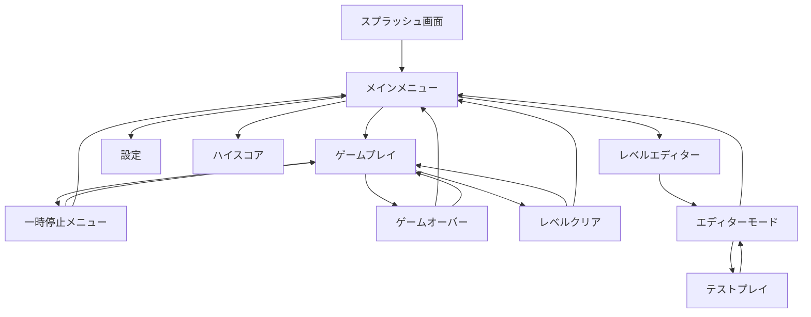

# ブロック崩しゲーム UX仕様書

## 1. UXビジョン

### 1.1 デザイン哲学
**「懐かしさと新しさの融合」** - クラシックなアーケードゲームの本質を保ちながら、現代的なビジュアル表現とインタラクションで新鮮な体験を提供する。

### 1.2 コアUX原則
- **即座に理解可能**: 説明不要で直感的に操作できる
- **視覚的フィードバック**: すべてのアクションに満足感のある反応
- **流れるような体験**: 画面遷移やアニメーションがスムーズ
- **アクセシブル**: すべてのユーザーが楽しめる設計
- **カスタマイズ可能**: 個人の好みに合わせられる柔軟性

## 2. 画面遷移フロー



## 3. 画面仕様

### 3.1 スプラッシュ画面
**表示時間**: 2秒（スキップ可能）

**要素**:
- ゲームロゴ（アニメーション付き）
- ローディングバー
- 「Click to Start」テキスト（1秒後に表示）

**アニメーション**:
```css
/* ロゴアニメーション */
@keyframes logoReveal {
  0% { 
    opacity: 0; 
    transform: scale(0.8) rotate(-5deg);
  }
  50% { 
    opacity: 1; 
    transform: scale(1.1) rotate(2deg);
  }
  100% { 
    opacity: 1; 
    transform: scale(1) rotate(0deg);
  }
}
```

### 3.2 メインメニュー

**レイアウト構成**:
```
┌─────────────────────────────────┐
│         [BLOCK BREAKER]          │ <- タイトル（ネオングロー）
│                                  │
│        ▶ START GAME             │ <- メニュー項目
│          HIGH SCORES             │
│          SETTINGS                │
│          LEVEL EDITOR            │
│          ABOUT                   │
│                                  │
│     [Theme: NEON] [♪] [?]       │ <- クイックアクセス
└─────────────────────────────────┘
```

**インタラクション**:
- ホバー時: アイテムが拡大（scale: 1.05）+ グロー効果
- クリック時: パルスアニメーション + サウンドフィードバック
- キーボード: 上下キーでナビゲーション、Enterで選択
- ゲームパッド対応

### 3.3 ゲームプレイ画面

**レイアウト構成**:
```
┌─────────────────────────────────────┐
│ SCORE: 12,500  LEVEL: 3  LIVES: ♥♥♥ │ <- HUD
├─────────────────────────────────────┤
│                                     │
│         [ゲームキャンバス]           │ <- Canvas要素
│                                     │
│                                     │
├─────────────────────────────────────┤
│ [||] COMBO x5  🔥 FIRE BALL  2:45  │ <- ステータスバー
└─────────────────────────────────────┘
```

**HUD要素詳細**:

| 要素 | 表示内容 | アニメーション |
|------|----------|---------------|
| スコア | 数値（カンマ区切り） | カウントアップアニメーション |
| レベル | 現在レベル/総レベル | レベルアップ時フラッシュ |
| ライフ | ハートアイコン | 減少時に振動+赤フラッシュ |
| コンボ | 連続ヒット数 | 数値が大きくなるほど色が変化 |
| パワーアップ | アクティブな効果 | アイコン+残り時間バー |

### 3.4 一時停止メニュー

**オーバーレイデザイン**:
```
┌─────────────────────────┐
│      GAME PAUSED        │
│                         │
│    ▶ RESUME            │
│      RESTART LEVEL      │
│      SETTINGS           │
│      MAIN MENU          │
│                         │
│   Press ESC to resume   │
└─────────────────────────┘
```

**視覚効果**:
- 背景: ゲーム画面をブラー（blur: 5px）+ 暗転（opacity: 0.7）
- メニュー: 中央にフェードイン（300ms）
- 選択中アイテム: パルスアニメーション

### 3.5 設定画面

**タブ構成**:
```
┌──────────────────────────────────┐
│ [GAME] [AUDIO] [CONTROLS] [VIDEO] │
├──────────────────────────────────┤
│ GAME SETTINGS                     │
│                                   │
│ Difficulty:    [Easy|Normal|Hard] │
│ Ball Speed:    [▬▬▬▬▬█▬▬▬▬] 70%  │
│ Paddle Size:   [S|M|L|XL]         │
│ Power-ups:     [ON|OFF]           │
│                                   │
│ [Apply] [Reset] [Cancel]          │
└──────────────────────────────────┘
```

### 3.6 レベルエディター

**インターフェース構成**:
```
┌─────────────────────────────────────────┐
│ [File] [Edit] [View] [Test]  Level: New │ <- メニューバー
├───────────┬─────────────────────────────┤
│           │                             │
│  BLOCKS   │      CANVAS AREA            │ <- 作業領域
│  [■][▣][▢] │                             │
│  [◆][○][★] │      (Grid Overlay)         │
│           │                             │
│  TOOLS    │                             │
│  [↖][✋][🗑] │                             │
│           │                             │
├───────────┴─────────────────────────────┤
│ Properties: Block Type: Hard, HP: 3     │ <- プロパティパネル
└─────────────────────────────────────────┘
```

## 4. ビジュアルテーマ仕様

### 4.1 ネオンテーマ
**カラーパレット**:
```css
:root {
  --neon-primary: #00ffff;    /* シアン */
  --neon-secondary: #ff00ff;   /* マゼンタ */
  --neon-accent: #ffff00;      /* イエロー */
  --neon-bg: #0a0a0a;         /* ダークグレー */
  --neon-glow: 0 0 20px;      /* グロー効果 */
}
```

**特徴**:
- すべての要素にネオングロー効果
- 暗い背景に鮮やかな蛍光色
- トレイルエフェクト付きボール
- パーティクルは光の粒子

### 4.2 ピクセルテーマ
**カラーパレット**:
```css
:root {
  --pixel-primary: #5fcde4;   /* レトロブルー */
  --pixel-secondary: #fbf236; /* レトロイエロー */
  --pixel-accent: #ff004d;    /* レトロレッド */
  --pixel-bg: #29366f;        /* レトロネイビー */
  --pixel-size: 4px;          /* ピクセルサイズ */
}
```

**特徴**:
- 8ビット風ピクセルアート
- ドット絵風フォント（Press Start 2P）
- カクカクした動き（意図的）
- チップチューン風効果音

### 4.3 シンセウェーブテーマ
**カラーパレット**:
```css
:root {
  --synth-primary: #ff6b9d;   /* ホットピンク */
  --synth-secondary: #c44569; /* ダークピンク */
  --synth-accent: #66d9ef;    /* エレクトリックブルー */
  --synth-bg: linear-gradient(#2e1f47, #0f0c29);
  --synth-grid: #ff00ff33;    /* グリッド線 */
}
```

**特徴**:
- グラデーション背景
- レトロフューチャーグリッド
- スキャンライン効果
- VHS風グリッチエフェクト

### 4.4 ミニマルテーマ
**カラーパレット**:
```css
:root {
  --minimal-primary: #333333;  /* チャコール */
  --minimal-secondary: #666666;/* グレー */
  --minimal-accent: #ff3333;   /* アクセントレッド */
  --minimal-bg: #ffffff;       /* ホワイト */
  --minimal-border: 2px solid; /* ボーダースタイル */
}
```

**特徴**:
- モノクローム中心
- 幾何学的形状
- 細いライン
- 余白を活かしたデザイン

## 5. インタラクションデザイン

### 5.1 マイクロインタラクション

**ボタンホバー**:
```typescript
// ホバーアニメーション
onMouseEnter: {
  scale: 1.05,
  glow: true,
  sound: 'hover.mp3',
  duration: 200
}
```

**クリックフィードバック**:
```typescript
onClick: {
  scale: [1, 0.95, 1.1, 1],
  sound: 'click.mp3',
  haptic: 'light',
  duration: 300
}
```

### 5.2 トランジション

**画面遷移**:
```css
/* フェードスライド */
.screen-transition-enter {
  opacity: 0;
  transform: translateY(20px);
}

.screen-transition-enter-active {
  opacity: 1;
  transform: translateY(0);
  transition: all 300ms ease-out;
}
```

### 5.3 ゲームエフェクト

**ブロック破壊エフェクト**:
1. ブロックが振動（100ms）
2. パーティクル爆発（20-30個）
3. スコアポップアップ（上方向フェード）
4. 画面シェイク（強度によって調整）
5. サウンド再生（ピッチ変調）

**コンボエフェクト**:
```typescript
interface ComboEffect {
  x2_x5: {
    color: 'yellow',
    fontSize: '1.2em',
    shake: 'light'
  },
  x6_x10: {
    color: 'orange',
    fontSize: '1.5em',
    shake: 'medium',
    particles: true
  },
  x11_plus: {
    color: 'red',
    fontSize: '2em',
    shake: 'heavy',
    particles: true,
    screenFlash: true
  }
}
```

## 6. レスポンシブデザイン

### 6.1 ブレークポイント
```css
/* デスクトップ */
@media (min-width: 1024px) {
  .game-canvas { width: 800px; height: 600px; }
}

/* タブレット */
@media (min-width: 768px) and (max-width: 1023px) {
  .game-canvas { width: 100%; max-width: 768px; }
}

/* モバイル */
@media (max-width: 767px) {
  .game-canvas { width: 100%; height: 70vh; }
  .controls { position: fixed; bottom: 0; }
}
```

### 6.2 タッチコントロール

**モバイルUI**:
```
┌────────────────────┐
│                    │
│   ゲームキャンバス   │
│                    │
├────────────────────┤
│  ◀  スワイプ領域  ▶  │ <- パドル操作
│    [PAUSE] [🔊]    │ <- コントロールボタン
└────────────────────┘
```

**ジェスチャー**:
- スワイプ: パドル移動
- タップ: ボール発射/一時停止
- ピンチ: ズーム（エディターモード）
- 長押し: メニュー表示

## 7. アクセシビリティ

### 7.1 キーボードナビゲーション
```typescript
const keyBindings = {
  // メニューナビゲーション
  ArrowUp: 'menuUp',
  ArrowDown: 'menuDown',
  Enter: 'select',
  Escape: 'back',
  
  // ゲームプレイ
  ArrowLeft: 'paddleLeft',
  ArrowRight: 'paddleRight',
  A: 'paddleLeft',
  D: 'paddleRight',
  Space: 'launch/pause',
  P: 'pause',
  R: 'restart',
  
  // アクセシビリティ
  Tab: 'nextElement',
  ShiftTab: 'prevElement'
};
```

### 7.2 視覚サポート

**カラーブラインド対応**:
```css
/* Protanopia/Deuteranopia モード */
.colorblind-mode {
  --success: #0088cc;  /* 青 */
  --warning: #ffaa00;  /* オレンジ */
  --danger: #cc0000;   /* 赤の代わりに濃い赤 */
}
```

**ハイコントラストモード**:
```css
.high-contrast {
  --bg: #000000;
  --fg: #ffffff;
  --border-width: 3px;
  --font-weight: bold;
}
```

### 7.3 スクリーンリーダー対応
```html
<!-- ARIAラベル例 -->
<button aria-label="ゲームを開始" role="button">
  START GAME
</button>

<div role="status" aria-live="polite" aria-atomic="true">
  <span>スコア: 12,500点</span>
</div>

<div role="alert" aria-live="assertive">
  <span>ゲームオーバー</span>
</div>
```

## 8. アニメーション仕様

### 8.1 イージング関数
```typescript
const easings = {
  // UIアニメーション
  smooth: 'cubic-bezier(0.25, 0.1, 0.25, 1)',
  
  // ゲームエフェクト
  bounce: 'cubic-bezier(0.68, -0.55, 0.265, 1.55)',
  
  // パーティクル
  explosive: 'cubic-bezier(0.165, 0.84, 0.44, 1)',
  
  // メニュートランジション
  elegant: 'cubic-bezier(0.4, 0, 0.2, 1)'
};
```

### 8.2 パフォーマンス考慮
```css
/* GPU加速を使用 */
.animated-element {
  will-change: transform, opacity;
  transform: translateZ(0); /* レイヤー作成 */
}

/* 低スペックモード */
@media (prefers-reduced-motion: reduce) {
  * {
    animation-duration: 0.01ms !important;
    transition-duration: 0.01ms !important;
  }
}
```

## 9. サウンドデザイン

### 9.1 効果音マッピング
| アクション | サウンド | 特徴 |
|-----------|---------|------|
| ボール反射 | bounce.mp3 | ピッチ変調（速度による） |
| ブロック破壊 | break_1-5.mp3 | ランダム選択 |
| パワーアップ | powerup.mp3 | 上昇音階 |
| レベルクリア | clear.mp3 | ファンファーレ |
| ゲームオーバー | gameover.mp3 | 下降音階 |
| コンボ | combo_x2-x10.mp3 | 段階的に派手に |

### 9.2 BGM仕様
```typescript
interface BGMConfig {
  menu: {
    track: 'menu_loop.mp3',
    volume: 0.5,
    loop: true,
    fadeIn: 1000
  },
  gameplay: {
    tracks: ['game_1.mp3', 'game_2.mp3', 'game_3.mp3'],
    volume: 0.3,
    loop: true,
    crossfade: true,
    intensity: 'dynamic' // スコアに応じて変化
  }
}
```

## 10. パフォーマンス指標

### 10.1 アニメーションパフォーマンス
- FPS: 60fps維持（95%以上の時間）
- 入力遅延: <16ms
- アニメーションジャンク: 0
- First Contentful Paint: <1.5s
- Time to Interactive: <2.5s

### 10.2 メモリ使用量
- 初期ロード: <50MB
- ゲームプレイ中: <150MB
- パーティクル最大時: <200MB

## 11. ユーザビリティテスト項目

### 11.1 初回プレイテスト
- [ ] 説明なしでゲームを開始できるか
- [ ] 基本操作を30秒以内に理解できるか
- [ ] メニューナビゲーションが直感的か
- [ ] 設定変更が即座に反映されるか
- [ ] エラー時の復帰が適切か

### 11.2 長時間プレイテスト
- [ ] 30分プレイしても疲れないか
- [ ] パフォーマンス劣化がないか
- [ ] 繰り返しプレイしたくなるか
- [ ] 進行状況が適切に保存されるか

## 12. フィードバックシステム

### 12.1 視覚的フィードバック優先度
1. **即座**: 入力への反応（0-50ms）
2. **短期**: アクション結果（50-200ms）
3. **中期**: 状態変化（200-500ms）
4. **長期**: 達成通知（500ms-2s）

### 12.2 触覚フィードバック（モバイル）
```typescript
const hapticPatterns = {
  ballHit: { type: 'light', duration: 10 },
  blockBreak: { type: 'medium', duration: 20 },
  powerUp: { type: 'heavy', duration: 30 },
  gameOver: { type: 'double', duration: 50 }
};
```

## まとめ

このUX仕様書は、モダンレトロなブロック崩しゲームの優れたユーザー体験を実現するための詳細なガイドラインを提供している。視覚的な魅力、直感的な操作性、満足感のあるフィードバック、そしてアクセシビリティを重視した設計により、幅広いユーザーに愛されるゲームを目指す。

## 13. MVPスコープ明確化

### 13.1 初期リリース（v1.0）に含まれる機能
- **ビジュアルテーマ**: ネオンテーマのみ
- **パワーアップ**: 3種類（マルチボール、パドルサイズ、スピード）
- **レベル**: 10レベル（プリセット）
- **サウンド**: 基本的な効果音とBGM
- **プラットフォーム**: デスクトップ優先、モバイル基本対応

### 13.2 将来バージョン（v2.0）で追加予定
- **追加テーマ**: ピクセル、シンセウェーブ、ミニマル
- **レベルエディター**: カスタムレベル作成機能
- **追加パワーアップ**: 貫通ボール、マグネットパドル
- **高度な機能**: リプレイシステム、グローバルリーダーボード
- **完全なモバイル最適化**: ジェスチャー操作の改善